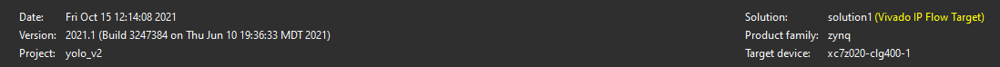
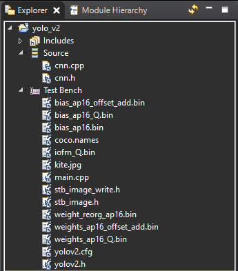

## YOLOv2 Accelerator
This repo is about YOLOv2 accelerator implemented in Vitis HLS 2021.1. 

1. Check that the binary files from step 02 has been copied to this directory. Rename cnn_hls.cpp to cnn.cpp.
2. Create a new project in the Vitis HLS with the following settings

__Target Device:  xc7z020-clg400-1__ 

__Target clock: 5.2__ (Estimated: 5.2 Uncertainty: 0.65;) 

3. Add the cnn.* files as source and the rest shown below as part of the testbench

4. Run the Simulation, then Synthesis, then implementation and Export RTL
